# Georgia Real Estate Market — Business Insights Report

> - **Data source:** [myhome.ge](https://www.myhome.ge) — Georgia's largest real estate portal
> - **Dataset:** 432,759 active listings scraped March 2026
> - **Full dataset on Kaggle:** [ismetsemedov/myhome](https://www.kaggle.com/datasets/ismetsemedov/myhome)

---

## Executive Summary

Georgia's real estate market is **highly concentrated, agency-driven, and rental-heavy**. Tbilisi alone accounts for 89% of all national listings. Renting is nearly twice as common as buying. Agencies control 87% of all transactions, leaving minimal room for private sellers. Old Tbilisi commands the highest sale prices per square metre, while Gldani-Nadzaladevi offers the best rental yields — a key insight for investors seeking returns over prestige.

---

## 1. Market Concentration — Tbilisi Dominates

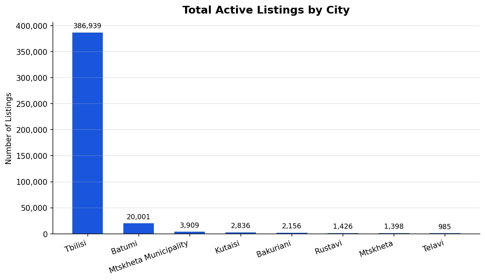

**What it shows:** Out of 432,759 active listings nationwide, 386,939 (89%) are in Tbilisi. Batumi is the only meaningful secondary market at 20,001 listings (5%). All other cities combined represent just 6%.

**Why it matters:**
- Any platform, product, or investment strategy focused on Georgia real estate must be built primarily around Tbilisi.
- Batumi is the only viable second market for property investment, tourism rentals, or regional expansion.
- Cities like Kutaisi and Rustavi have negligible listing volumes — entering those markets carries high liquidity risk.

---

## 2. Renting Outpaces Buying 2-to-1

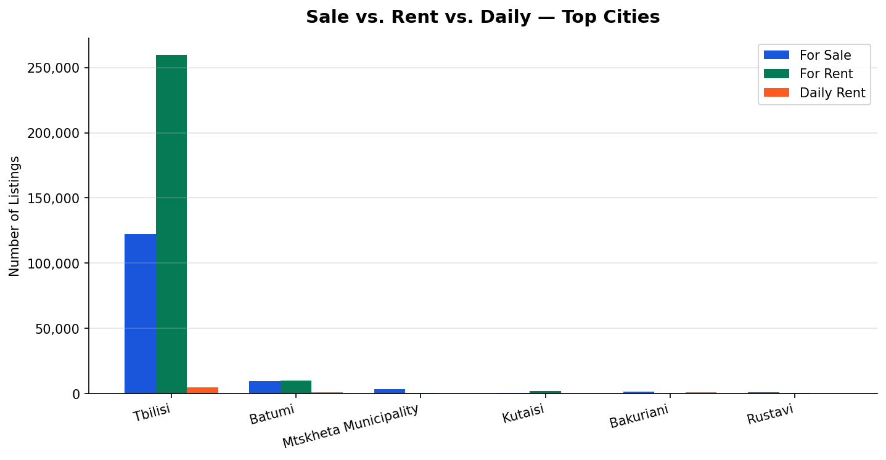

**What it shows:** Across all cities, rental listings (274,588) outstrip sale listings (150,324) by nearly 2:1. Batumi is the exception — nearly equal volumes of sales and rentals — reflecting its dual role as a permanent-residence and holiday-rental market. Daily rentals (7,481) are concentrated in Batumi and Bakuriani, confirming their short-stay tourism character.

**Why it matters:**
- Rental demand is the primary market force. Products, services, and advertising targeting renters will reach the largest audience.
- Batumi's balanced split signals strong investor appetite for buy-to-let property. It is the strongest market outside Tbilisi for short-term rental returns.
- Bakuriani's daily-heavy profile points to seasonal ski-tourism demand — a niche with concentrated high-season pricing power.

---

## 3. Apartments Are the Market — Everything Else Is Secondary

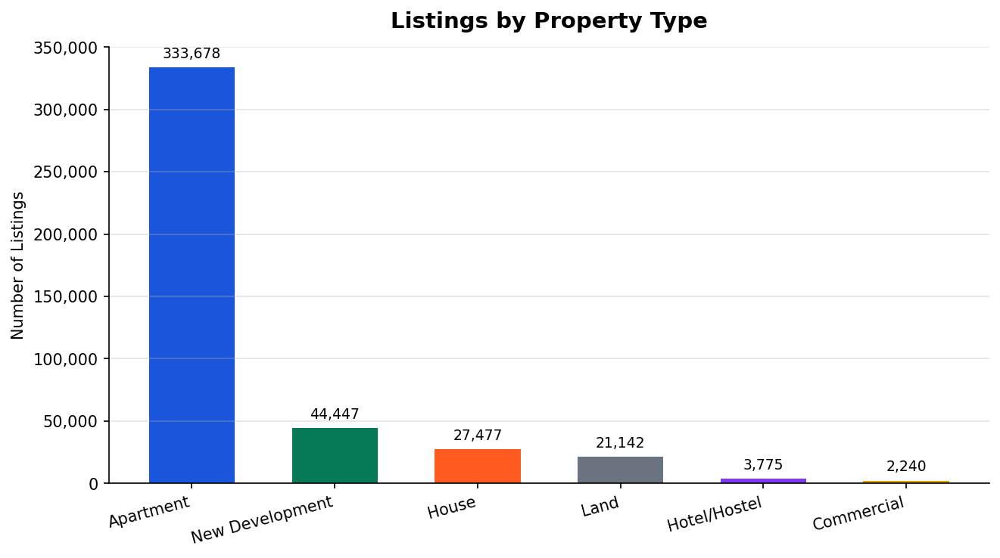

**What it shows:** Apartments account for 333,678 listings (77%). New developments follow at 44,447 (10%), houses at 27,477 (6%), and land at 21,142 (5%). Hotels/hostels and commercial properties are niche categories below 4%.

**Why it matters:**
- Resources, pricing models, and marketing should be built around apartments first.
- New developments (10%) represent a significant developer-driven segment that may offer higher commission margins and volume deal opportunities.
- Land and houses are secondary asset classes with lower liquidity and smaller buyer pools.

---

## 4. Sale Prices — Where the Premium Neighbourhoods Are

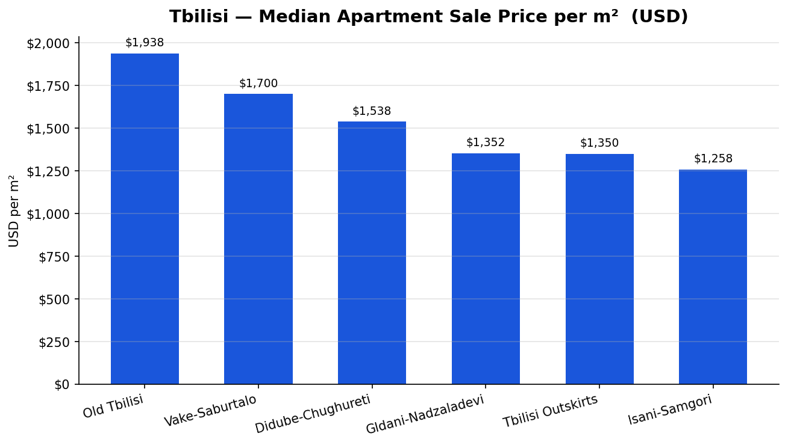

**What it shows:** Median apartment sale prices per square metre in Tbilisi range from **$1,258/m²** (Isani-Samgori) to **$1,938/m²** (Old Tbilisi). Vake-Saburtalo, the city's most established residential district, sits at $1,700/m².

| District | Median Sale Price/m² |
|---|---|
| Old Tbilisi | $1,938 |
| Vake-Saburtalo | $1,700 |
| Didube-Chughureti | $1,538 |
| Gldani-Nadzaladevi | $1,352 |
| Tbilisi Outskirts | $1,350 |
| Isani-Samgori | $1,258 |

**Why it matters:**
- The **54% price premium** of Old Tbilisi over Isani-Samgori indicates distinct market tiers. Premium buyers target Old Tbilisi and Vake; value buyers target Isani and Gldani.
- Sellers and agents in Vake-Saburtalo operate in the highest-volume premium segment — the best target for high-value service products.
- Developers should consider that the price ceiling is anchored in Old Tbilisi. New developments in Vake-Saburtalo carry the strongest pricing power.

---

## 5. Monthly Rents — District-by-District Comparison

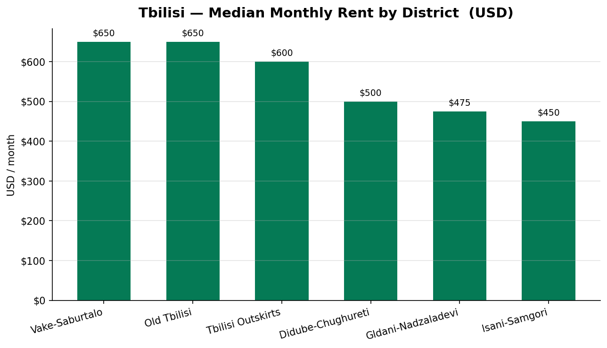

**What it shows:** Median monthly rents in Tbilisi range from **$450/month** (Isani-Samgori) to **$650/month** (Vake-Saburtalo and Old Tbilisi). Gldani-Nadzaladevi is the most affordable rental district at $475/month.

**Why it matters:**
- The rent gap between districts is narrower (44%) than the sale price gap (54%), suggesting that rental demand is more uniformly distributed across the city.
- Tenants priced out of Vake can find comparable quality in Didube or Gldani at 25–30% lower cost — a key insight for tenant-matching services.
- Landlords in Isani-Samgori face the most competitive rental environment; premium listings and staging services could command significant price uplift.

---

## 6. Rental Yield — Best Returns Are Not Where Prices Are Highest

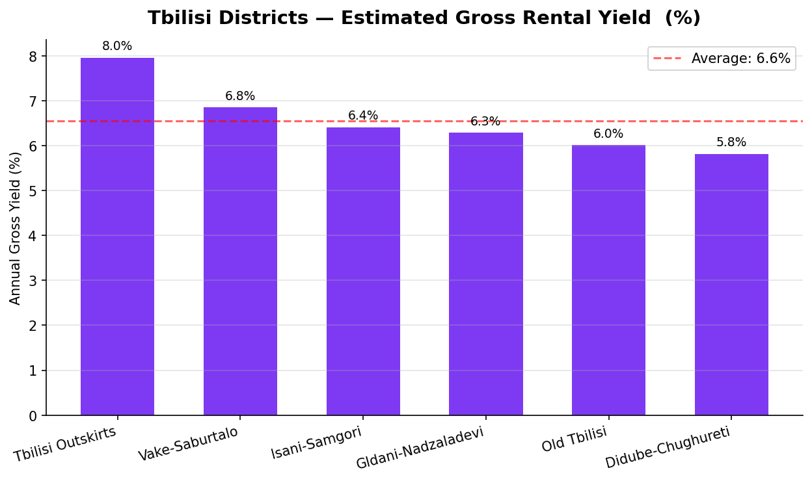

**What it shows:** Estimated gross annual rental yield — the return an investor earns on a property purchase through rent — varies significantly by district. Gldani-Nadzaladevi and Isani-Samgori deliver the **highest yields**, while the prestigious Old Tbilisi and Vake-Saburtalo offer lower returns relative to their purchase prices.

**Why it matters:**
- Investors seeking **income return** should target Gldani-Nadzaladevi and Isani-Samgori — lower purchase prices with solid rental demand.
- Investors seeking **capital appreciation** (value growth over time) are better served by Old Tbilisi and Vake-Saburtalo, where prestige and scarcity drive price growth.
- This yield inversion is a critical insight: the most expensive districts are not the most profitable for rental income.

---

## 7. Sale Price Distribution — The Mass Market Window

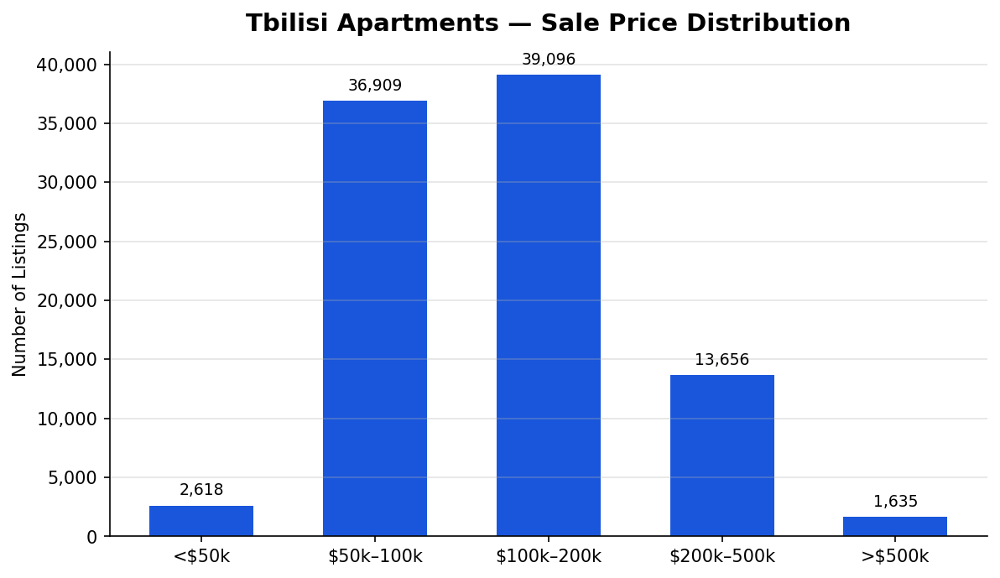

**What it shows:** The Tbilisi apartment sales market is concentrated in the **$50,000–$200,000** range, which accounts for 80% of all listings. Properties above $500,000 represent fewer than 2% of the market.

**Why it matters:**
- The mass market opportunity is firmly in the $50k–$200k band. Mortgage products, buyer services, and agent commission structures should be calibrated to this range.
- The $200k–$500k segment (14,000 listings) is an underserved premium segment with higher transaction values but lower competition.
- Ultra-luxury properties (>$500k) are a niche — relevant for boutique agencies but not a volume business.

---

## 8. Rental Market — What Tenants Are Actually Paying

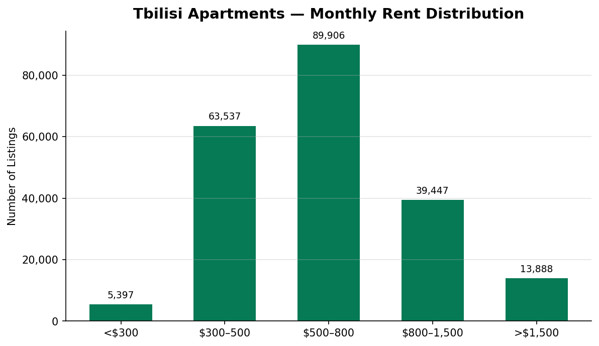

**What it shows:** The Tbilisi rental market is anchored in the **$500–$800/month** band, accounting for 90,000 listings — the single largest segment. The $300–$500 band holds 64,000 listings. Together these two brackets cover 60% of all rentals.

**Why it matters:**
- Tenant demand is strongest in the $500–$800 range. Property management services, furniture packages, and tenant screening products should be priced to serve landlords in this segment.
- Only 14,000 listings exceed $1,500/month — the premium rental segment is real but limited.
- The $300–$500 band represents the affordable rental market — likely attracting local Georgian tenants rather than expats.

---

## 9. What Buyers Pay by Apartment Size

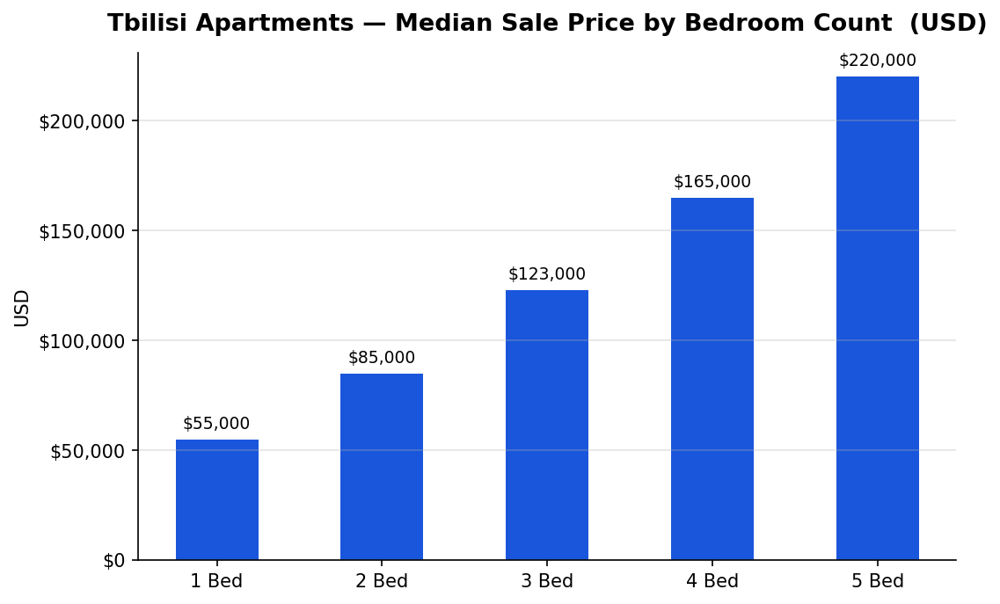

**What it shows:** Median sale prices scale predictably with bedroom count — from **$55,000 for 1-bedroom** apartments to **$220,000 for 5-bedroom** units. The largest price jump occurs between 2-bed ($85k) and 3-bed ($123k) — a $38,000 step-up.

**Why it matters:**
- The 2-to-3 bedroom transition is the most significant value threshold in the market. This is where buyers make their biggest financial stretch — and where financing, valuation, and advisory services have the highest impact.
- 1-bedroom units at $55k median represent the most accessible entry point — ideal for first-time buyers and young professional tenants-turned-buyers.

---

## 10. Monthly Rents by Apartment Size

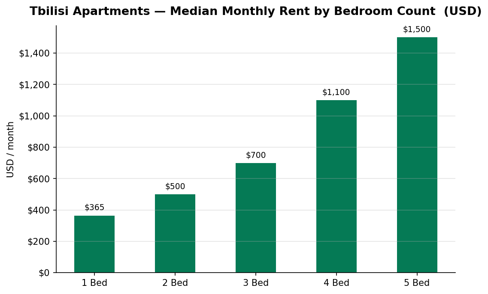

**What it shows:** Monthly rents range from **$365/month for 1-bedroom** to **$1,500/month for 5-bedroom** apartments. The 2-to-3 bedroom jump ($500 to $700) is again the most significant — a 40% increase.

**Why it matters:**
- Families upgrading from 2-bed to 3-bed face the steepest rental increase. This segment has the highest churn potential and is most responsive to relocation assistance.
- 2-bedroom apartments at $500/month represent the highest-volume rental product — the sweet spot for property managers and landlords seeking fast occupancy.

---

## 11. Who Controls the Market — Agencies Overwhelmingly Dominate

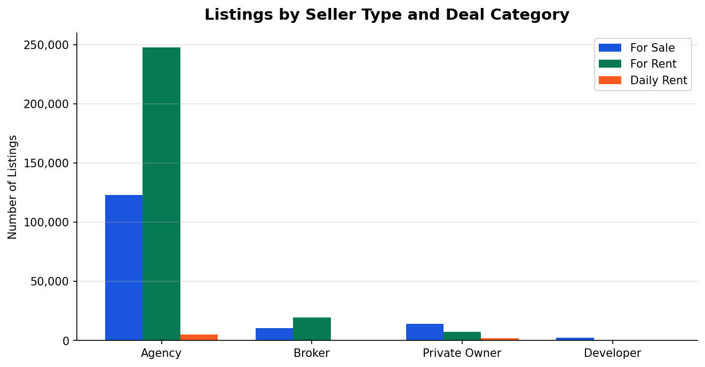

**What it shows:** Real estate agencies list 375,695 properties (87% of all listings). Private owners account for only 23,811 listings (5.5%). Brokers hold 30,713 (7%), and developers list 2,540 properties.

**Why it matters:**
- The Georgian real estate market is **intermediary-controlled**. Platform success requires agency partnership — private-seller-first strategies will miss 94% of available inventory.
- The tiny developer segment (0.6%) is disproportionately important: developers list new constructions with higher unit values and larger project volumes.
- Private owner listings may command premium positioning — buyers often prefer to deal directly — but volume is too small to build a business model around.

---

## 12. Batumi — Premium by the Sea

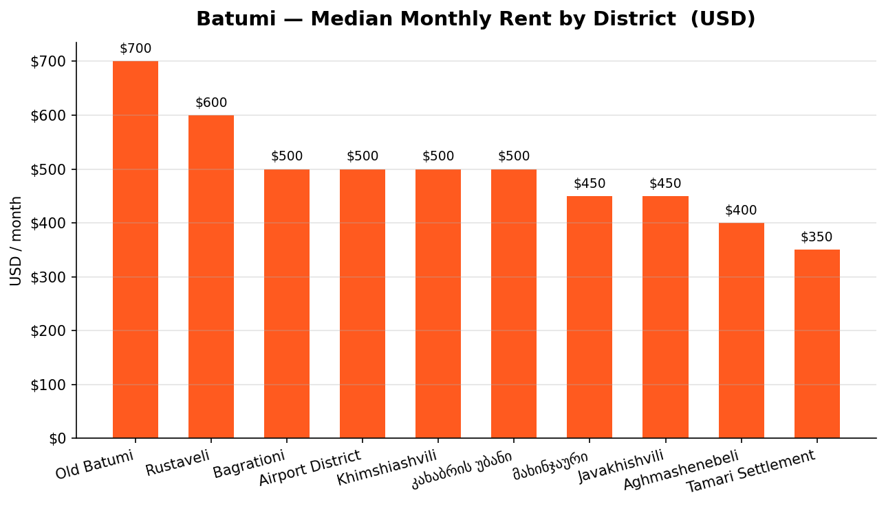

**What it shows:** In Batumi, the Old Batumi and Rustaveli districts command the highest rents at **$700 and $600/month** respectively. The Airport District and Khimshiashvili — typically associated with newer developments — are mid-range at $500/month.

**Why it matters:**
- Batumi's rental premium is concentrated in its historic and central districts, not in the newer coastal towers. This suggests that **location character** matters more than modernity in Batumi's rental market.
- With 786 daily rentals, Batumi has a significant short-stay tourism economy. Old Batumi and Rustaveli are prime zones for Airbnb-style investment.
- Investors considering Batumi should weigh that sale prices are rising with tourism demand — rental yields should be validated carefully before committing.

---

## Strategic Recommendations

| Priority | Action | Rationale |
|---|---|---|
| **1** | Focus product and sales resources on Tbilisi | 89% of market; Batumi as secondary expansion |
| **2** | Prioritise the rental segment | 2× the volume of sales; fastest-moving inventory |
| **3** | Partner with agencies first | 87% of all listings; essential for inventory access |
| **4** | Target the $50k–$200k sale band | 80% of buyer demand; highest transaction volume |
| **5** | Position investment products toward Gldani/Isani | Highest rental yields; underserved by premium services |
| **6** | Build premium services for Vake-Saburtalo | Highest price/m²; largest single district; most agency competition |
| **7** | Develop Batumi short-stay offering | Growing tourism rental economy; year-round demand |

---

*Report generated from 432,759 active listings on myhome.ge — March 2026.*
*Full dataset: [kaggle.com/datasets/ismetsemedov/myhome](https://www.kaggle.com/datasets/ismetsemedov/myhome)*
